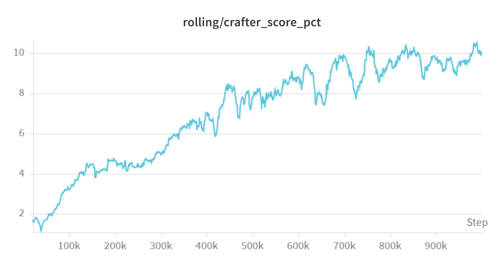

# Rainbow-IQN + RND on Crafter

This implementation extends classic DQN with a modern Rainbow-IQN stack, combining distributional RL (IQN), Munchausen-augmented targets, intrinsic exploration (RND + NovelD), and a dual-head dueling architecture over a shared IMPALA encoder — alongside standard Rainbow upgrades: Double DQN, Dueling networks, NoisyNet, Prioritized Experience Replay, and n-step returns. It is trained on the [Crafter](https://github.com/danijar/crafter) benchmark (Hafner et al., 2021).

The goal of this project was to build a **state-of-the-art DQN implementation** with the latest tricks from the literature — without switching to model-based RL. After a full training run (1M environment steps), the agent reaches a **Crafter Score of 9.56%** in a 429-episode post-training evaluation — well above classic Rainbow (~4.3%) and competitive with DreamerV2 (~10%), but below a **hardware-constrained DreamerV3** run (17.05% on the same eval protocol; see comparison below).



---

## Results

The primary metric is **Crafter Score**: \( S = \exp(\mean(\ln(1 + s_i\%))) - 1 \), where \( s_i \) is the unlock rate of the *i*-th achievement in the evaluation window (in percent).

**Evaluation protocol (both agents):** post-training eval, deterministic / greedy policy, extrinsic reward only. Rainbow: `rnd_beta=0`, NoisyNet off. DreamerV3: `mode='eval'`. **429 episodes** (~100k env steps) — the same budget used for the DreamerV3 comparison run.

### Summary (429 episodes)

| Metric | Rainbow-IQN | DreamerV3 (size50m) |
|--------|------------:|--------------------:|
| Episodes | 429 | 429 |
| **Crafter Score** | **9.56%** | **17.05%** |
| Mean reward | 6.89 | 10.47 |
| Mean length | 207.4 | 231.6 |
| Achievements/ep | 7.8 | 11.4 |
| Unique unlocked | 15/22 | 16/22 |

### Demo episodes

<p align="center">
  
  &nbsp;&nbsp;
  
</p>

<p align="center"><sub><b>Left:</b> Rainbow-IQN (CS 9.56%) &nbsp;·&nbsp; <b>Right:</b> DreamerV3 size50m (CS 17.05%)</sub></p>

> **Note on DreamerV3:** The attached DreamerV3 checkpoint is **not** the full paper configuration. It was trained with the `size50m` preset (~41M params) on an **RTX 3070 8 GB** GPU (WSL2) with reduced `train_ratio` (128 vs 512), `batch_size` 8 (vs 16), and replay buffer 1M (vs 5M) — see [Experimental setup](#experimental-setup) below. Literature DreamerV3 on Crafter reports ~14% Crafter Score with a larger model and more compute.

### Achievement unlock rates (429 episodes)

| Achievement | Rainbow-IQN | DreamerV3 |
|-------------|----------:|----------:|
| collect_coal | 3.5% | 57.3% |
| collect_diamond | 0.0% | 0.0% |
| collect_drink | 40.3% | 87.6% |
| collect_iron | 0.0% | 0.0% |
| collect_sapling | 97.7% | 76.7% |
| collect_stone | 16.1% | 91.8% |
| collect_wood | 98.6% | 99.8% |
| defeat_skeleton | 5.6% | 13.8% |
| defeat_zombie | 63.6% | 64.3% |
| eat_cow | 43.6% | 19.3% |
| eat_plant | 0.0% | 0.0% |
| make_iron_pickaxe | 0.0% | 0.0% |
| make_iron_sword | 0.0% | 0.0% |
| make_stone_pickaxe | 0.0% | 0.0% |
| make_stone_sword | 0.2% | 0.2% |
| make_wood_pickaxe | 65.5% | 98.8% |
| make_wood_sword | 52.9% | 96.5% |
| place_furnace | 0.0% | 71.1% |
| place_plant | 97.4% | 76.0% |
| place_stone | 14.5% | 90.2% |
| place_table | 89.7% | 99.1% |
| wake_up | 90.2% | 97.0% |

Rainbow strengths: early-game survival and wood crafting (`collect_sapling`, `place_plant`, `collect_wood`). DreamerV3 leads on mid/late-game achievements (`collect_coal`, `collect_stone`, `place_furnace`, `collect_drink`) — consistent with model-based long-horizon planning.

> **Training vs eval:** During training the Rainbow agent uses NoisyNet and intrinsic motivation (`Q_ext + 0.1·Q_int`). Evaluation measures the pure extrinsic policy — consistent with the benchmark convention.

---

## Algorithm Components

**Implicit Quantile Networks (IQN)** — Models the full return distribution $Z(s, a)$ using sampled quantiles instead of predicting a single scalar $Q(s, a)$. It maps uniformly sampled probabilities $\tau \sim U(0, 1)$ to quantile values and is trained via the quantile Huber loss, allowing for a more flexible and continuous representation of the return distribution than categorical alternatives like C51.

**Munchausen RL** — Augments the Bellman target for the extrinsic head by adding a clipped log-policy bonus to the immediate reward and a penalty to the bootstrap term. Following Vieillard et al. (2020), $\log \pi$ is derived entirely from the target network's softmax distribution to guarantee training stability.

**Dual-head IQN** — Features a shared IMPALA-style convolutional encoder and quantile embedding network, which branches into two independent dueling heads for separate extrinsic and intrinsic value estimation. The intrinsic head uses a shorter discount ($\gamma_{\text{int}} = 0.9$) to prevent long-horizon curiosity traps, and its loss is down-weighted by $0.25\times$ to ensure the shared encoder remains primarily shaped by the extrinsic objective — a design principle inspired by NGU and Agent57.

**RND + NovelD** — Combines Random Network Distillation for state novelty estimation with NovelD, which computes transition-based intrinsic rewards. NovelD ensures the agent is rewarded specifically for crossing into novel states, preventing reward stagnation in already-explored areas.

**IMPALA-style encoder** — A deep residual convolutional network optimized for pixel-based RL, providing robust visual representations in complex environments such as Procgen or Crafter.

**NoisyNet** — Replaces $\varepsilon$-greedy with parameter-space exploration via learned noise layers, enabling more structured and state-dependent exploration.

**Prioritized Experience Replay (PER)** — SumTree-backed replay buffer that samples high-priority transitions more frequently, using mean quantile Huber loss as the TD-error proxy. Sampling bias is corrected with annealed importance-sampling weights ($\beta$).

**Rainbow staples** — Double DQN (online selects, target evaluates), dueling value/advantage decomposition, n-step returns ($n = 3$), and hard target sync every 2000 learn steps (soft Polyak was unstable for distributional Q).

**Replay buffer persistence** — Network checkpoints plus compressed `.npz` buffer snapshots for crash recovery without losing experience.

---

## Architecture (Overview)

```
64×64 RGB × 4 frames  →  (12, 64, 64)
        ↓
   IMPALA Encoder → 512-d
        ↓
   Quantile Embedding(τ)
        ↓
   ┌────────────────┴────────────────┐
   ↓                                 ↓
Dueling IQN Head (ext)        Dueling IQN Head (int)
   ↓                                 ↓
Q_ext(s, a, τ)                Q_int(s, a, τ)

Action: argmax_a [ mean_τ Q_ext + β · mean_τ Q_int ]     (β = 0.1)
```

In parallel: **RNDModule** computes NovelD rewards → separate replay stream → Q_int learning (non-episodic bootstrap).

---

## Installation

```bash
git clone https://github.com/v-ade-r/Rainbow_IQN_Crafter.git
cd Rainbow_IQN_Crafter
python -m venv .venv
source .venv/bin/activate
pip install -r requirements.txt
```

Requirements: Python ≥ 3.10, CUDA (recommended), ~15 GB RAM for the 250k RGB replay buffer.

---

## Usage

### Training (1M steps, default Hydra config)

```bash
python scripts/train.py
```

Quick pipeline smoke test:

```bash
python scripts/train.py test_run=true
```

Resume from checkpoint:

```bash
python scripts/train.py resume_checkpoint=checkpoints/agent_step_500000.pt
```

W&B logging: project `rainbow-iqn-crafter`. Checkpoints saved to `checkpoints/` (`.pt` / `.npz` gitignored; push `agent_final.pt` separately when ready).

### Evaluation (429 episodes — DreamerV3-comparable protocol)

```bash
python scripts/evaluate.py checkpoints/agent_final.pt --episodes 429 --device cuda
```

Shorter sanity check (100 episodes):

```bash
python scripts/evaluate.py checkpoints/agent_final.pt --episodes 100 --device cuda
```

### Interactive demo (Gradio)

```bash
python scripts/demo_gradio.py checkpoints/agent_final.pt --device cuda --port 7860
```

### Record episode GIF

```bash
python scripts/record_demo.py checkpoints/agent_final.pt -o results/demo_episode.gif
python scripts/record_demo.py checkpoints/agent_final.pt -o results/demo_episode.gif --max-steps 500 --fps 10 --scale 8 --device cuda
```

Frames are upscaled 8× with nearest-neighbor (64→512 px) for crisp pixel-art display; this affects demo/GIF only, not training.

### Hyperparameter tuning (Optuna)

```bash
python scripts/tune_optuna.py
```

### Tests

```bash
pytest
```

---

## Repository Structure

```
rainbow_iqn_crafter/
├── results/              # training curve, demo GIF
├── configs/              # Hydra: agent, env, logger
├── scripts/
│   ├── train.py          # main training loop
│   ├── evaluate.py       # Crafter Score eval (DreamerV3-style report)
│   ├── demo_gradio.py    # interactive demo
│   ├── record_demo.py    # save episode to GIF
│   └── tune_optuna.py    # hyperparameter search
├── src/
│   ├── agents/           # RainbowIQNAgent
│   ├── components/       # PER buffer, SumTree, RND/NovelD
│   ├── networks/         # IMPALA encoder, IQN heads, NoisyNet
│   ├── envs/             # Crafter wrappers
│   └── utils/            # losses, logging, diagnostics
└── tests/                # unit + smoke tests
```

---

## Configuration

### Rainbow-IQN — key hyperparameters

Training budget and loop (`configs/main.yaml`):

| Parameter | Value | Description |
|-----------|------:|-------------|
| `total_steps` | 1 000 000 | Crafter benchmark budget |
| `training_starts` | 20 000 | random actions before learning |
| `train_freq` | 4 | env steps per learn call |
| `checkpoint_freq` | 50 000 | save interval |
| `seed` | 42 | |

Environment (`configs/env/crafter.yaml`):

| Parameter | Value |
|-----------|------:|
| `frame_stack` | 4 |
| `action_repeat` | 1 |
| `image_size` | 64 (RGB) |

Agent (`configs/agent/rainbow_iqn.yaml`):

| Parameter | Value | Description |
|-----------|------:|-------------|
| `gamma` | 0.99 | extrinsic discount |
| `gamma_int` | 0.9 | intrinsic discount |
| `n_step` | 3 | n-step return length |
| `buffer_size` | 250 000 | PER replay buffer (~11.7 GB RAM) |
| `batch_size` | 64 | |
| `target_update_freq` | 2000 | hard sync (learn steps) |
| `rnd_beta` | 0.1 | Q_int weight at action selection |
| `loss_int_weight` | 0.25 | intrinsic loss weight |
| `encoder_type` | impala | IMPALA CNN encoder |
| `n_quantiles_train` | 32 | IQN quantiles (train) |
| `n_quantiles_eval` | 64 | IQN quantiles (eval) |
| `learning_rate` | 1e-4 | Adam |
| `munchausen_alpha` | 0.9 | Munchausen bonus scale |
| `munchausen_tau` | 0.03 | Munchausen temperature |

Full config: `configs/main.yaml` + Hydra CLI overrides.

---

## Experimental setup

Both agents were trained on the **same Crafter benchmark** under comparable hardware constraints (WSL2, **RTX 3070 8 GB**, 32 GB RAM).

| | Rainbow-IQN (this repo) | DreamerV3 (comparison) |
|--|-------------------------|------------------------|
| Task | Crafter sparse reward | `crafter_reward` |
| Observation | RGB 64×64, frame stack 4 | RGB 64×64 |
| Train steps | 1 000 000 | 1 000 000 |
| Eval episodes | 429 (~100k steps) | 429 (~100k steps) |
| Eval policy | greedy, `rnd_beta=0` | `mode='eval'` |
| Model size | ~IMPALA + dual IQN heads | **size50m** (~41M params; paper uses size200m) |
| Main constraint | replay buffer 250k (RAM) | `train_ratio` 128, batch 8, replay 1M (VRAM/RAM) |

**DreamerV3 run details** (full config in companion repo: `dreamer_v3/CRAFTER_SETUP.md`):

- Run ID: `size50m-20260608-233544`
- Overrides vs default `crafter` preset: `size50m` model, `train_ratio=128` (4× fewer gradient steps per env step), `batch_size=8`, replay `size=1M` (not 5M)
- Eval run: `eval-size50m-20260608-233544`, checkpoint from above
- Crafter Score formula identical to this repo (`exp(mean(log(1 + rate%))) − 1`)

---

## References

- Hafner et al. (2021) — [Crafter benchmark](https://github.com/danijar/crafter)
- Dabney et al. (2018) — Implicit Quantile Networks
- Hessel et al. (2018) — Rainbow DQN
- Fortunato et al. (2018) — NoisyNet
- Schaul et al. (2016) — Prioritized Experience Replay
- Vieillard et al. (2020) — Munchausen RL / M-DQN
- Burda et al. (2018) — Random Network Distillation
- Zhang et al. (2021) — NovelD
- Espeholt et al. (2018) — IMPALA encoder

---

## License

MIT — see [LICENSE](LICENSE).
